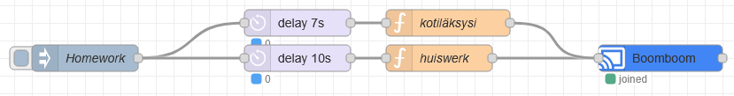
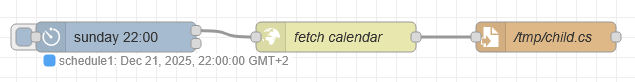
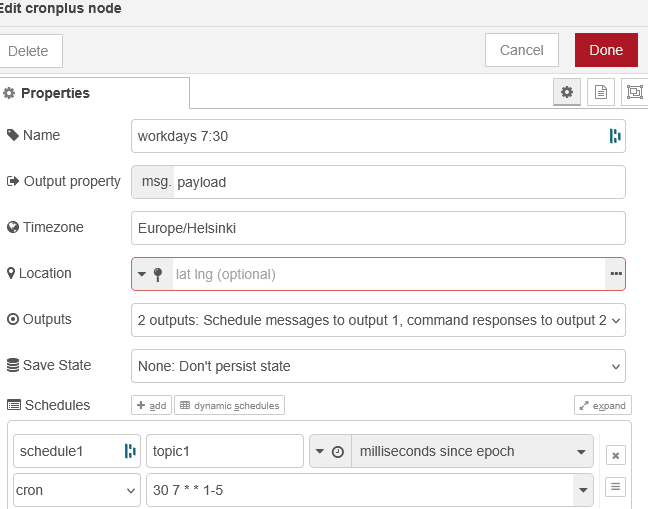
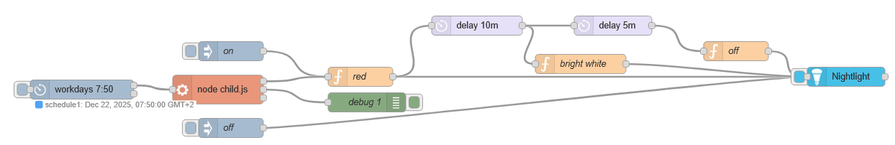
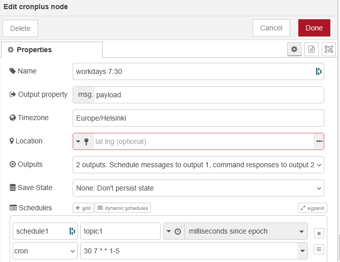

Node-red uses nodes which send json messages to the next node. For example an inject node that triggers a typescript node that creates a payload that sends a text-to-speech to a soundbar with chromecast

 

 msg.payload = {}
 msg.payload = {"type":"TTS","text":"Teitkö kotiläksysi","speed":1,"language":"fi","metadata":{"title":"Pappa talks"}}
 return msg;

This is a node-red flow to trigger a nightlight, 30 minutes before school starts. This flow needs cronplus and huemagic added to the palette. From the hamburger menu on the right top, select "manage palette" and install node-red-contrib-cron-plus and node-red-contrib-huemagic-fork

A cronplus node fetches every week the school calendar from Wilma and saves the ICS calendar file. I use cronplus to take timezones into account.

Daily a cronplus starts in the morning and a javascript that uses ical.js to calculate the minutes until the first lesson and substracts 30 minutes to trigger a red light, which after 5 minutes will turn white and after 10 minutes will turn off.

HueMagic is used to connect to my Philips HUE bridge. The HUE bridge has an API and HueMagic 
Find you bridges using the discovery API https://discovery.meethue.com/ or use mdns philips-hue.local

 msg.payload = {}
 msg.payload.on = true;
 msg.payload.color = "red";
 msg.payload.brightness = 100;
 return msg;

=== Wilma ICS ===
There is no direct API to fetch the calendars from Wilma. But in the web, there is a place to download the calendar as ICS file. There the URL can be copied

The URL is different for each school. The students have a unique number and the login to wilma has a token
https://helsinki.inschool.fi/schedule/export/students/654321/Wilma.ics?token=0123456789&p=28&f=56&tstamp=1762955000

https://yvkoulut.inschool.fi/schedule/export/students/654321/Wilma.ics?token=0123456789c&p=28&f=56&tstamp=1762955000

An ICS file can have a repeating schedule, e.g. every tuesday at 9:00 math. To find out what the first lesson of the day is, a script will have to parse all events one at a time and find the earliest starting moment.

The script child.js script then waits until 30 minutes before school starts and triggers the light.

the trigger starts on weekdays at 7:30 and runs for a maximum of 10 hours. It does not take corner cases into account when school is on saturday or they do a midnight run.

=== Inspiration ===
Wilma API
Apparently there is an API and OpenWilma is (was?) an attempt to use it.
https://github.com/developerfromjokela/wilma_api/blob/master/Wilman_JSON-rajapintav2.pdf
https://github.com/OpenWilma/openwilma.js/blob/master/src/types/Schedule.d.ts

Project OtaWilma pointed out the ICS calendar and token usage
https://github.com/Project-OtaWilma/WilmaAPI
